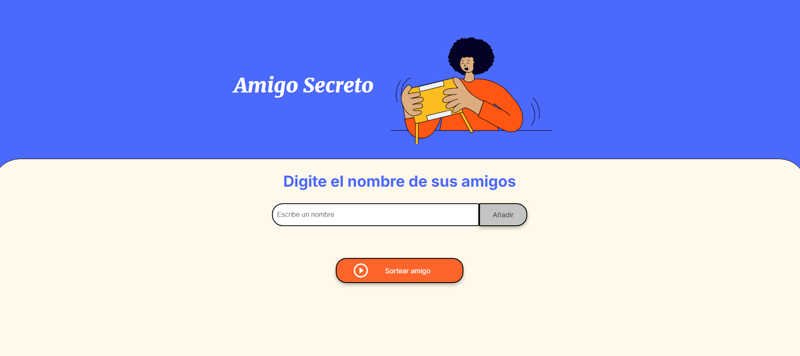

# 📄 README - Juego de Amigo Secreto

¡Bienvenido al repositorio del **Juego de Amigo Secreto**! Este es un proyecto simple y divertido que te permite organizar un sorteo de amigos secretos. Es ideal para eventos, fiestas o simplemente para divertirte con tus amigos.

---

## 🚀 **Cómo funciona**

El proyecto consiste en una aplicación web donde puedes:
1. **Agregar nombres**: Escribe los nombres de tus amigos en la lista.
2. **Sortear**: El sistema selecciona aleatoriamente un amigo secreto para cada participante.
3. **Ver el resultado**: El nombre del amigo secreto se muestra en pantalla.

---

## 🛠️ **Tecnologías utilizadas**

- **HTML**: Estructura de la página.
- **CSS**: Estilos y diseño.
- **JavaScript**: Lógica del sorteo y manipulación del DOM.
- **Git y GitHub**: Control de versiones y alojamiento del código.

---

## 🎮 **Cómo usar la aplicación**

1. **Agregar nombres**: Escribe el nombre de un amigo en el campo de texto. Haz clic en "Añadir" para agregarlo a la lista.

2. **Sortear**: Cuando hayas agregado todos los nombres, haz clic en "Sortear amigo". Luego, el sistema seleccionará aleatoriamente un amigo secreto y lo mostrará en pantalla.

3. **Reiniciar**: Si deseas realizar otro sorteo, simplemente actualiza la página.

---

## 🏙️ **Interfaz del juego**
  
*Interfaz principal del juego.*

---

## 🎉 ¡Espero que disfrutes el proyecto!

